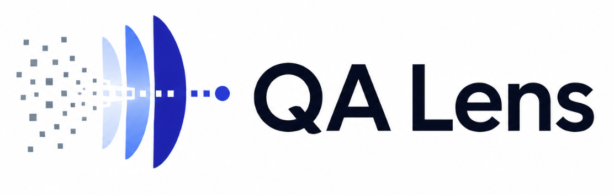

# QA Lens

QA Lens turns existing automation test reports into local, explainable triage intelligence.

[](LICENSE)
[](https://www.python.org/)
[](#common-cli-commands)

<p align="center">
  
</p>

## What QA Lens Does

QA Lens reads reports that your test framework already generates, stores the results in a local SQLite database, and helps answer:

- What failed in the latest run?
- What changed compared with previous runs?
- Which failures look related?
- Which tests are flaky or risky?
- What should the team inspect first?
- Is the suite getting better or worse?

QA Lens is not a test runner and not a replacement for Allure, Extent, Playwright, Cypress, JUnit, or TestNG. It is an analysis layer on top of those reports.

## Key Features

- Local CLI: `qalens`
- Local web UI for runs, incidents, trends, risk, comparison, chat, and settings
- Deterministic failure classification and clustering
- SQLite-backed run history
- Flakiness and risk signals across multiple runs
- Decision summary and “fix first” style prioritization
- HTML, Markdown, and JSON report export
- Optional LLM-assisted chat
- Local-first defaults with no telemetry

## Supported Report Formats

| Format | Supported input |
|---|---|
| Allure | Allure HTML report folders and JSON-backed report data |
| Extent | Extent HTML reports, including common v4/v5 exports |
| JUnit | `testsuite` / `testsuites` XML |
| TestNG | `testng-results.xml` |
| Playwright | JSON reports and JSON-backed HTML report folders |
| Cypress / Mocha | JSON reports, including Mochawesome-style output |

## Requirements

For source checkout development:

- Python 3.10+
- Git
- Node.js 18+ and npm, required to build the web UI from source

SQLite is built into Python. You do not need to install a separate SQLite server.

LLMs are optional. QA Lens works without an LLM for ingestion, deterministic summaries, reports, risk, comparison, and many factual `qalens ask` questions.

## Quick Start

Clone the repo:

```bash
git clone https://github.com/Arulprasath36/QALens.git
cd QALens
```

Create and activate a virtual environment:

```bash
python3 -m venv .venv
source .venv/bin/activate
python -m pip install --upgrade pip
```

On Windows PowerShell:

```powershell
py -m venv .venv
.\.venv\Scripts\Activate.ps1
python -m pip install --upgrade pip
```

Install QA Lens:

```bash
pip install -e ".[dev]"
```

Build the web UI from source:

```bash
cd frontend
npm ci
npm run build
cd ..
```

Ingest a sample report:

```bash
qalens ingest tests/fixtures/allure_sample --db ./qalens.db
```

Start the web UI:

```bash
qalens serve --db ./qalens.db
```

Open:

```text
http://127.0.0.1:8080
```

Ask a deterministic question:

```bash
qalens ask "What broke in the latest run?" --db ./qalens.db
```

## Common CLI Commands

Detect a report type:

```bash
qalens detect tests/fixtures/allure_sample
qalens detect tests/fixtures/extent_sample
```

Extract normalized JSON:

```bash
qalens extract tests/fixtures/allure_sample --out extracted.json
```

Ingest a report:

```bash
qalens ingest tests/fixtures/allure_sample --db ./qalens.db
```

Analyze stored runs:

```bash
qalens analyze --db ./qalens.db
```

Compare run history:

```bash
qalens compare --db ./qalens.db --by runs --window 10
qalens compare --db ./qalens.db --by owners --window 10
qalens compare --db ./qalens.db --by modules --window 10
qalens compare --db ./qalens.db --by suites --window 10
```

Inspect one target over time:

```bash
qalens history test "testCreditCardPayment()" --db ./qalens.db
qalens history owner "Checkout Team" --db ./qalens.db
qalens history suite "Payments" --db ./qalens.db
qalens history module "checkout-module" --db ./qalens.db
qalens history failure FINGERPRINT --db ./qalens.db
```

Generate a one-off Markdown summary directly from a report:

```bash
qalens summarize tests/fixtures/allure_sample --format markdown --out summary.md
```

Show failure clusters directly from a report:

```bash
qalens clusters tests/fixtures/allure_sample
```

Export a standalone report from the database:

```bash
qalens report --db ./qalens.db --out qa-lens-report.html
qalens report --db ./qalens.db --format markdown --out qa-lens-report.md
qalens report --db ./qalens.db --format json --out qa-lens-report.json
```

## Demo Dataset

For a richer demo, use the synthetic ShopNow dataset:

```text
tmp_test_data/ShopNow_E-Commerce/
```

Each `run_###/` directory is one report run.

Create a demo database:

```bash
for report in tmp_test_data/ShopNow_E-Commerce/run_*; do
  qalens ingest "$report" --db ./shopnow-demo.db
done
```

Analyze the history:

```bash
qalens analyze --db ./shopnow-demo.db
```

Open the UI:

```bash
qalens serve --db ./shopnow-demo.db
```

Export a report:

```bash
qalens report --db ./shopnow-demo.db --out shopnow-report.html
```

## Web UI

The local web UI includes:

| View | Purpose |
|---|---|
| Runs | Latest runs, failures, decision brief, and test details |
| Incidents | Shared failure signatures and recurring clusters |
| Analysis | Suite trends, pass-rate journey, owner load, and active failure clusters |
| Risk | Tests most likely to fail or flip in future runs |
| Compare | Compare runs, owners, modules, or suites |
| Chat | Ask deterministic or LLM-assisted questions over stored data |
| Settings | Runtime paths, auth mode, database status, and LLM settings |

For frontend development, run the API and Vite separately.

Terminal 1:

```bash
qalens serve --db ./qalens.db --no-open
```

Terminal 2:

```bash
cd frontend
npm run dev
```

Open:

```text
http://localhost:3000
```

The Vite dev server proxies `/api/*` requests to `http://localhost:8080`.

## Deterministic vs LLM-Assisted Answers

QA Lens has deterministic analysis by default. These features do not require an LLM:

- Ingesting reports
- Detecting formats
- Failure classification
- Failure clustering
- Run comparison
- Risk signals
- Shareable report export
- Many factual `qalens ask` answers, such as “What broke in the latest run?”

LLM-assisted answers are optional. They are useful for open-ended triage questions, but they require a configured local or cloud provider.

Create a config file:

```bash
qalens llm-config --init
qalens llm-config --show
```

By default, QA Lens points to a local Ollama-compatible endpoint. QA Lens does not install or run Ollama for you.

For cloud LLM providers, explicitly allow external calls:

```toml
[llm]
provider = "openai"
allow_external = true
```

Or:

```bash
export QALENS_ALLOW_EXTERNAL_LLM=1
```

Only enable cloud LLMs after reviewing what report data may leave your machine.

## Authentication

By default, `qalens serve` binds to localhost and does not require login.

For token-based access:

```bash
export QALENS_AUTH_TOKEN="replace-with-a-long-random-token"
qalens serve --db ./qalens.db --host 0.0.0.0 --allow-public-bind
```

Or for one session:

```bash
qalens serve --db ./qalens.db --auth-token "replace-with-a-long-random-token"
```

For GitHub OAuth:

```bash
export QALENS_AUTH_MODE=github
export QALENS_GITHUB_CLIENT_ID="github-oauth-client-id"
export QALENS_GITHUB_CLIENT_SECRET="github-oauth-client-secret"
export QALENS_SESSION_SECRET="$(openssl rand -base64 32)"
export QALENS_ALLOWED_GITHUB_USERS="your-github-login,teammate-login"
export QALENS_ALLOWED_GITHUB_ORGS="your-org"
export QALENS_ADMIN_GITHUB_USERS="your-github-login"

qalens serve --db ./qalens.db
```

For networked deployments, use HTTPS and review [SECURITY.md](SECURITY.md) and [PRODUCTION_CHECKLIST.md](PRODUCTION_CHECKLIST.md).

## Database Behavior

By default, QA Lens stores data in:

```text
~/.qalens/qalens.db
```

Use a project-local database with:

```bash
qalens ingest tests/fixtures/allure_sample --db ./qalens.db
qalens serve --db ./qalens.db
```

The SQLite database is the source of truth for the web UI, run history, comparison, trends, incidents, and report exports.

## Owner Mapping

If reports do not include owner metadata, provide an owner mapping file during ingestion:

```bash
qalens ingest tests/fixtures/allure_sample --db ./qalens.db --owner-map owners.toml
```

Example:

```toml
[[owners]]
owner = "Authentication Team"
suites = ["Authentication*"]
tags = ["auth", "login"]

[[owners]]
owner = "Checkout Team"
features = ["Checkout", "Payments"]
tests = ["testPayPal*", "testCreditCardPayment()"]

[[owners]]
owner = "Search Team"
test_regex = ["Search.*Filter"]
```

Existing owner labels from the report are preserved by default. Use `--override-owners` when the mapping file should replace report-provided owners.

## Artifact And Screenshot Handling

QA Lens is text-first. Screenshots are optional supporting evidence.

Artifact modes:

| Mode | Behavior |
|---|---|
| `text-only` | Store textual failure data only |
| `metadata-only` | Store screenshot metadata, hashes, dimensions, and references; no image bytes |
| `full` | Store metadata and image bytes in an artifact directory |

Default mode:

```text
metadata-only
```

Examples:

```bash
qalens ingest ./my-report --artifact-mode text-only
qalens ingest ./my-report --artifact-mode metadata-only
qalens ingest ./my-report --artifact-mode full --artifact-storage-dir ~/.qalens/artifacts
```

Image bytes are never stored in SQLite. In `full` mode, image files are written to the configured artifact store directory.

## Security Notes

QA Lens treats reports as untrusted input.

Security defaults include:

- Local-first operation
- No telemetry
- Report file validation
- Raster image validation by magic bytes
- SVG artifact rejection
- Secret redaction before LLM submission
- Optional token or GitHub OAuth authentication
- Cloud LLM providers disabled unless explicitly allowed

Before exposing the web UI beyond localhost, review:

- [SECURITY.md](SECURITY.md)
- [PRODUCTION_CHECKLIST.md](PRODUCTION_CHECKLIST.md)

## Python API

```python
from qalens.api.library import QALensClient

client = QALensClient()

report_type = client.detect_report("./reports/allure-report")
run = client.extract_report("./reports/allure-report")
analysis = client.analyze_report(run)

summary = client.summarize_report(analysis, fmt="markdown")
print(summary)
```

## Project Structure

```text
QALens/
├── src/qalens/              # Python package
├── frontend/                # React + Vite web UI
├── tests/                   # Python tests and parser fixtures
├── docs/                    # Architecture and design docs
├── examples/                # CI examples and sample output
├── tmp_test_data/           # Synthetic demo dataset
├── pyproject.toml           # Python package metadata
├── Makefile                 # Build shortcuts
├── SECURITY.md              # Security policy
└── PRODUCTION_CHECKLIST.md  # Network deployment checklist
```

## Limitations

- QA Lens does not execute tests.
- Single-run data is enough for basic failure summaries, but trends, risk, and flakiness need multiple ingested runs.
- LLM-assisted answers require a configured LLM provider.
- Parser accuracy depends on the data exported by the report tool.
- The web server is local-first. Do not expose it publicly without authentication, HTTPS, and network controls.
- Strict repository-wide `ruff`, `mypy`, and `bandit` cleanup is still in progress.

## Roadmap

Near-term focus:

- More real-world report fixtures
- Documentation polish and screenshots
- CI quality gate cleanup
- More parser edge-case coverage
- More export formats and CI examples

See [docs/roadmap.md](docs/roadmap.md).

## Contributing

Contributions are welcome. Start with [CONTRIBUTING.md](CONTRIBUTING.md).

Useful local checks:

```bash
pytest
cd frontend && npm run typecheck && npm test
```

## License

[Apache 2.0](LICENSE)
